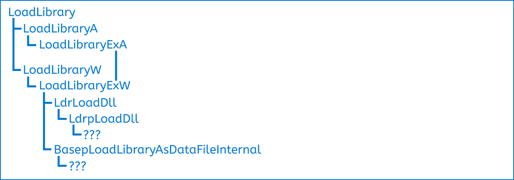

<br>

# LEGAL NOTICE
<ins><b>I do not take responsibility for any misuse of these information in any way.</b></ins>

The purpose of these series are **only** to understand Windows better, there is a lot to discover.

# Information
There will be some terms I use you may not understand, so I wanted to explain them in here first.

### Levels
The depth level (it's what I say) of the functions, as the level get higher, the functions get less documented and harder to understand.
<br><br><br>
<a href="https://discord.gg/9qe38utdBJ" target="blank"></a> [Discord](https://discord.gg/9qe38utdBJ "For other questions etc.")


<hr>

# What is LoadLibrary?
LoadLibrary is a Windows API function used for loading modules into programs.

The usage is pretty simple, you include Windows.h into your project, then you can use it.

There is 4 main LoadLibrary functions you can use
- [LoadLibraryA](https://learn.microsoft.com/en-us/windows/win32/api/libloaderapi/nf-libloaderapi-loadlibrarya "MSDN Reference")
- [LoadLibraryW](https://learn.microsoft.com/en-us/windows/win32/api/libloaderapi/nf-libloaderapi-loadlibraryw "MSDN Reference")
- [LoadLibraryExA](https://learn.microsoft.com/en-us/windows/win32/api/libloaderapi/nf-libloaderapi-loadlibraryexa "MSDN Reference")
- [LoadLibraryExW](https://learn.microsoft.com/en-us/windows/win32/api/libloaderapi/nf-libloaderapi-loadlibraryexw "MSDN Reference")

Even if they look like seperate, they all end up in **LoadLibraryExW** finally, wanna learn how? Keep reading.

# Level 1
All the functions I've said above are declared in KERNEL32.DLL, but their actual definitions are inside KERNELBASE.dll, because both these modules are well documented and have their own PDB, it wasn't that hard to understand them.

<hr>

## LoadLibraryA
### LoadLibraryA (IDA Pseudocode)
```cpp
HMODULE __fastcall LoadLibraryA(LPCSTR lpLibFileName)
{
  PCHAR Heap; // rax
  PCHAR Heap_2; // rbx
  HMODULE ReturnModule; // rsi

  if ( !lpLibFileName )
    return LoadLibraryExA(lpLibFileName, 0i64, 0);
  if ( _stricmp(lpLibFileName, "twain_32.dll") )
    return LoadLibraryExA(lpLibFileName, 0i64, 0);
  // 260 = MAX_PATH
  Heap = (PCHAR)RtlAllocateHeap(NtCurrentPeb()->ProcessHeap, (unsigned int)KernelBaseGlobalData, 260i64);
  Heap_2 = Heap;
  if ( !Heap )
    return LoadLibraryExA(lpLibFileName, 0i64, 0);
  if ( GetWindowsDirectoryA(Heap, 0xF7u) - 1 > 0xF5
    || (strncat_s(Heap_2, 260ui64, "\\twain_32.dll", 0xDui64), (ReturnModule = LoadLibraryA(Heap_2)) == 0i64) )
  {
    RtlFreeHeap(NtCurrentPeb()->ProcessHeap, 0i64, Heap_2);
    return LoadLibraryExA(lpLibFileName, 0i64, 0);
  }
  RtlFreeHeap(NtCurrentPeb()->ProcessHeap, 0i64, Heap_2);
  return ReturnModule;
}
```
### LoadLibraryA (Simplified & Explained)
```cpp
HMODULE __fastcall LoadLibraryA(LPCSTR lpLibFileName)
{
    // If no path was given.
    if (!lpLibFileName)
        return LoadLibraryExA(lpLibFileName, 0, 0);
    // If path isn't 'twain_32.dll'
    // This is where our LoadLibrary calls mostly end up.
    if (_stricmp(lpLibFileName, "twain_32.dll"))
        return LoadLibraryExA(lpLibFileName, 0, 0);

    // If path is 'twain_32.dll'
    // Windows probably uses this to make itself a shortcut, while we are using it the code won't reach here.
    PCHAR Heap = (PCHAR)RtlAllocateHeap(NtCurrentPeb()->ProcessHeap, KernelBaseGlobalData, MAX_PATH);
    if (!Heap)
        return LoadLibraryExA(lpLibFileName, 0, 0);

    HMODULE ReturnModule;
    // Heap receives the Windows path (def: C:\Windows)
   
    // The BufferSize check made against GetWindowsDirectoryA is to see if it actually received. If it's bigger than BufferSize 
    // then GetWindowsDirectoryA returned the size needed (in summary it fails)
    
    // If this check doesn't fail '\twain_32.dll' is appended to the Windows path (def: C:\Windows\twain_32.dll)
    // Then this final module is loaded into the program.
    // If it can't load, it tries to load it directly and returns from there.
    if (GetWindowsDirectoryA(Heap, HeapSize) - 1 > BufferSize ||
       (strncat_s(Heap, MAX_PATH, "\\twain_32.dll", strlen("\\twain_32.dll")), (ReturnModule = LoadLibraryA(Heap)) == 0))
    {
        RtlFreeHeap(NtCurrentPeb()->ProcessHeap, 0, Heap);
        return LoadLibraryExA(lpLibFileName, 0, 0);
    }
    RtlFreeHeap(NtCurrentPeb()->ProcessHeap, 0, Heap);
    return ReturnModule;
}
```

So as you can also see, other than doing some checks, it ends up in LoadLibraryExA.
<hr>

## LoadLibraryW
### LoadLibraryW (IDA Pseudocode)
```cpp
HMODULE __fastcall LoadLibraryW(LPCWSTR lpLibFileName)
{
  return LoadLibraryExW(lpLibFileName, 0i64, 0);
}
```

Self explanatory.
<hr>

## LoadLibraryExA
### LoadLibraryExA (IDA Pseudocode)
```cpp
HMODULE __fastcall LoadLibraryExA(LPCSTR lpLibFileName, HANDLE hFile, DWORD dwFlags)
{
  HMODULE ReturnModule; // rbx
  UNICODE_STRING UnicodeString; // [rsp+20h] [rbp-18h] BYREF

  if ( !(unsigned int)Basep8BitStringToDynamicUnicodeString(&UnicodeString, lpLibFileName) )
    return 0i64;
  ReturnModule = LoadLibraryExW(UnicodeString.Buffer, hFile, dwFlags);
  RtlFreeUnicodeString(&UnicodeString);
  return ReturnModule;
}
```
### LoadLibraryExA (Simplified & Explained)
```cpp
HMODULE __fastcall LoadLibraryExA(LPCSTR lpLibFileName, HANDLE hFile, DWORD dwFlags)
{
    // As we are assuming LoadLibraryA was called directly, there won't be no hFile nor dwFlags.
    // If you call this function directly you can of course give args.

    HMODULE ReturnModule;
    UNICODE_STRING UnicodeString;

    // Converts ANSI lpLibFileName into UNICODE, if it can't, returns 0.
    if (Basep8BitStringToDynamicUnicodeString(&UnicodeString, lpLibFileName) == FALSE)
        return 0;
    ReturnModule = LoadLibraryExW(UnicodeString.Buffer, hFile, dwFlags);
    RtlFreeUnicodeString(&UnicodeString);
    return ReturnModule;
}
```

That's why I said everything ends up in LoadLibraryExW, even if you call LoadLibraryExA, it transforms your ANSI path to UNICODE.

<hr>

# Level 2
Even though still most of the stuff is documented, things get a little trickier.

## LoadLibraryExW
### LoadLibraryExW (IDA Pseuodocode)
```cpp
HMODULE __stdcall LoadLibraryExW(LPCWSTR lpLibFileName, HANDLE hFile, DWORD dwFlags)
{
  DWORD FlagCheck; // esi
  NTSTATUS NtStatus; // eax
  unsigned __int16 StrByteLen; // cx
  NTSTATUS LibraryAsDataFileInternal; // eax
  NTSTATUS NtStatus2; // edi
  __int64 NtStatus3; // rcx
  unsigned int v11; // eax
  bool IsStrByteLen2; // zf
  __int64 v13; // [rsp+30h] [rbp-20h] BYREF
  __int64 v14; // [rsp+38h] [rbp-18h] BYREF
  UNICODE_STRING DllName; // [rsp+40h] [rbp-10h] BYREF
  unsigned int NotSureFlags; // [rsp+70h] [rbp+20h] BYREF
  HMODULE BaseOfLoadedDll; // [rsp+88h] [rbp+38h] BYREF

  if ( !lpLibFileName )                         // If no filename was given to load
    goto INVALID_PARAM;
  if ( hFile )                                  // This directly proves hFile must be zero (msdn)
    goto INVALID_PARAM;
  if ( (dwFlags & 0xFFFF0000) != 0 )            // If a high bit (unsupported) is set
    goto INVALID_PARAM;
  FlagCheck = dwFlags & 0x42;                   // If LOAD_LIBRARY_AS_DATAFILE (0x2) and LOAD_LIBRARY_AS_DATAFILE_EXCLUSIVE (0x40) are both set in dwFlags
  if ( FlagCheck == 0x42 )
    goto INVALID_PARAM;
  NtStatus = RtlInitUnicodeStringEx(&DllName, lpLibFileName);
  if ( NtStatus < 0 )
    goto NTFAIL;
  StrByteLen = DllName.Length;
  if ( !DllName.Length )
    goto INVALID_PARAM;
  // To sum up the purpose is to reinitialize the length in byte format to length in character amount.
  do
  {
    if ( DllName.Buffer[((unsigned __int64)StrByteLen >> 1) - 1] != 0x20 )// Divides StrByteLen by 2 to get the amount of chars (because we are dealing with wchar every character is 2 bytes). Then subtracts 1 from that because arrays' start from idx 0. From there on (starting with the last char) checks if there's an empty char.
      break;
    // Checks if it's in the first character (because it started from the last this is actually the last idx)
    IsStrByteLen2 = StrByteLen == 2;
    StrByteLen -= 2;
    DllName.Length = StrByteLen;
  }
  while ( !IsStrByteLen2 );
  if ( !StrByteLen )                            // Checks if StrByteLen is invalid.
  {
INVALID_PARAM:
    NtStatus3 = 0xC000000Di64;                  // STATUS_INVALID_PARAMETER
    goto FAIL;
  }
  BaseOfLoadedDll = 0i64;
  // If none of LOAD_LIBRARY_AS_DATAFILE (0x2) and LOAD_LIBRARY_AS_DATAFILE_EXCLUSIVE (0x40) and LOAD_LIBRARY_AS_IMAGE_RESOURCE (0x20) is defined goes in, otherwise the Dll will not (REALLY) be loaded.
  if ( (dwFlags & 0x62) == 0 )
  {
    NotSureFlags = 0;
    v11 = 0;
    if ( (dwFlags & 1) != 0 )                   // If DONT_RESOLVE_DLL_REFERENCES is set
    {
      v11 = 2;
      NotSureFlags = 2;
    }
    if ( (dwFlags & 0x80u) != 0 )               // If LOAD_LIBRARY_REQUIRE_SIGNED_TARGET is set
    {
      v11 |= 0x800000u;
      NotSureFlags = v11;
    }
    if ( (dwFlags & 4) != 0 )                   // If UNDOCUMENTED flag is set (CAN'T BE SET BY USER I ASSUME)
    {
      v11 |= 4u;
      NotSureFlags = v11;
    }
    if ( (dwFlags & 0x8000) != 0 )              // If UNDOCUMENTED flag is set (CAN'T BE SET BY USER I ASSUME)
      NotSureFlags = v11 | 0x80000000;
    // The AND operation doesn't change anything, only the first bit is set by the OR operation. The first bit sets DONT_RESOLVE_DLL_REFERENCES flag, which results in the Dll's DllMain not getting called.
    // Some places say the first arg is PWCHAR PathToFile, I don't really see that.
    // The second may be dwFlags (combined with it at least)
    NtStatus2 = LdrLoadDll(dwFlags & 0x7F08 | 1i64, &NotSureFlags, &DllName, &BaseOfLoadedDll);// The AND operation doesn't change anything, only the first bit is set by the OR operation. The first bit sets DONT_RESOLVE_DLL_REFERENCES flag, which results in the Dll's DllMain not getting called.
    goto END;
  }
  NtStatus = LdrGetDllPath(DllName.Buffer, dwFlags & 0x7F08, &v13, &v14);
  if ( NtStatus < 0 )
  {
NTFAIL:
    NtStatus3 = (unsigned int)NtStatus;
    goto FAIL;
  }
  LibraryAsDataFileInternal = BasepLoadLibraryAsDataFileInternal(
                                (unsigned int)&DllName,
                                v13,
                                v14,
                                dwFlags,
                                (__int64)&BaseOfLoadedDll);
  NtStatus2 = LibraryAsDataFileInternal;
  if ( (int)(LibraryAsDataFileInternal + 0x80000000) >= 0
    && LibraryAsDataFileInternal != 0xC000000F
    && (dwFlags & 0x20) != 0 )
  {
    if ( FlagCheck )
      NtStatus2 = BasepLoadLibraryAsDataFileInternal(
                    (unsigned int)&DllName,
                    v13,
                    v14,
                    dwFlags & 0x42,
                    (__int64)&BaseOfLoadedDll);
  }
  RtlReleasePath(v13);
END:
  if ( NtStatus2 >= 0 )
    return BaseOfLoadedDll;
  NtStatus3 = (unsigned int)NtStatus2;
FAIL:
  BaseSetLastNTError(NtStatus3);
  return 0i64;
}
```
### LoadLibraryExW (Simplified & Explained)
```cpp
#define LOADLIBRARY_ISDATAFILE  (LOAD_LIBRARY_AS_DATAFILE | LOAD_LIBRARY_AS_IMAGE_RESOURCE | LOAD_LIBRARY_AS_DATAFILE_EXCLUSIVE)
#define LOADLIBRARY_7F08        (LOAD_LIBRARY_SEARCH_SYSTEM32_NO_FORWARDER | LOAD_LIBRARY_SAFE_CURRENT_DIRS | LOAD_LIBRARY_SEARCH_DEFAULT_DIRS | LOAD_LIBRARY_SEARCH_SYSTEM32 | LOAD_LIBRARY_SEARCH_USER_DIRS | LOAD_LIBRARY_SEARCH_APPLICATION_DIR | LOAD_LIBRARY_SEARCH_DLL_LOAD_DIR | LOAD_WITH_ALTERED_SEARCH_PATH)
#define LOADLIBRARY_ASDATAFILE  (LOAD_LIBRARY_AS_DATAFILE_EXCLUSIVE | LOAD_LIBRARY_AS_DATAFILE)
#define STATUS_NO_SUCH_FILE     0xC000000F

HMODULE __stdcall LoadLibraryExW(LPCWSTR lpLibFileName, HANDLE hFile, DWORD dwFlags)
{
    NTSTATUS Status;

    DWORD ConvertedFlags;
    HMODULE BaseOfLoadedDll;

    DWORD DatafileFlags = dwFlags & LOADLIBRARY_ASDATAFILE;
    // If no DllName was given OR hFile was given (msdn states that hFile must be 0) OR dwFlags is set to an unknown value OR *both* the Datafile flags are set (they cannot be used together).
    if (!lpLibFileName || hFile || ((dwFlags & 0xFFFF0000) != 0) || (DatafileFlags == LOADLIBRARY_ASDATAFILE))
    {
        BaseSetLastNTError(STATUS_INVALID_PARAMETER);
        return 0;
    }

    UNICODE_STRING DllName;
    Status = RtlInitUnicodeStringEx(&DllName, lpLibFileName);
    if (NT_SUCCESS(Status) == FALSE)
    {
        BaseSetLastNTError(Status);
        return 0;
    }

    USHORT DllNameLen = DllName.Length;
    if (!DllName.Length)
    {
        BaseSetLastNTError(STATUS_INVALID_PARAMETER);
        return 0;
    }

    // If the DllName given had empty (space) chars as their last chars, this do-while loop excludes them and sets the excluded length.
    do
    {
        DWORD WchAmount = DllNameLen / 2;
        if (DllName.Buffer[WchAmount - 1] != ' ' /* 0x20 is space char */)
            break;

        DllNameLen -= 2;
        DllName.Length = DllNameLen;
    } while (DllNameLen != 2);

    // In case the above do-while loop misbehaves.
    if (DllNameLen == 0)
    {
        BaseSetLastNTError(STATUS_INVALID_PARAMETER);
        return 0;
    }

    BaseOfLoadedDll = 0;

    // If the dll is not getting loaded as a datafile (loaded normally).
    if ((dwFlags & LOADLIBRARY_ISDATAFILE) == 0)
    {
        // Converts the actual flags into it's own flag format. Most flags are discarded (only used if loaded as datafile).
        // Only flags that can go through are DONT_RESOLVE_DLL_REFERENCES, LOAD_PACKAGED_LIBRARY, LOAD_LIBRARY_REQUIRE_SIGNED_TARGET and LOAD_LIBRARY_OS_INTEGRITY_CONTINUITY
        ConvertedFlags = 0;
        if ((dwFlags & DONT_RESOLVE_DLL_REFERENCES) != 0)
            ConvertedFlags |= 0x2;
        if ((dwFlags & LOAD_PACKAGED_LIBRARY) != 0)
            ConvertedFlags |= 0x4;
        if ((dwFlags & LOAD_LIBRARY_REQUIRE_SIGNED_TARGET) != 0)
            ConvertedFlags |= 0x800000;
        if ((dwFlags & LOAD_LIBRARY_OS_INTEGRITY_CONTINUITY) != 0)
            ConvertedFlags |= 0x80000000;

        // Evaluates dwFlags to get meaningful flags, includes DONT_RESOLVE_DLL_REFERENCES finally.
        // But it doesn't matter because the first param LdrLoadDll takes actually a (PWCHAR PathToFile), so I have no idea why that's done.
        Status = LdrLoadDll((PWCHAR)((dwFlags & LOADLIBRARY_7F08) | 1), &ConvertedFlags, &DllName, &BaseOfLoadedDll);
        if (NT_SUCCESS(Status))
            return BaseOfLoadedDll;

        BaseSetLastNTError(Status);
        return 0;
    }

    PWSTR Path;
    PWSTR Unknown;
    // Gets the Dll path.
    Status = LdrGetDllPath(DllName.Buffer, (dwFlags & LOADLIBRARY_7F08), &Path, &Unknown);
    if (NT_SUCCESS(Status) == FALSE)
    {
        BaseSetLastNTError(Status);
        return 0;
    }
    
    // First step into loading a module as datafile.
    Status = BasepLoadLibraryAsDataFileInternal(&DllName, Path, Unknown, dwFlags, &BaseOfLoadedDll);
    // If the Status is only success (excludes warnings) AND if the module is image resource, loads again. I don't know why.
    if (NT_SUCCESS(Status + 0x80000000) && Status != STATUS_NO_SUCH_FILE && (dwFlags & LOAD_LIBRARY_AS_IMAGE_RESOURCE) != 0)
    {
        if (DatafileFlags)
            Status = BasepLoadLibraryAsDataFileInternal(&DllName, Path, Unknown, DatafileFlags, &BaseOfLoadedDll);
    }

    RtlReleasePath(Path);
    BaseSetLastNTError(Status);
    return 0;
}
```

So from there on, we can see there is 2 pathways;
1. LdrLoadDll
2. BasepLoadLibraryAsDataFileInternal

I will be focused on LdrLoadDll and so on because that's the main way, but will check BasepLoadLibraryAsDataFileInternal too.

<hr>

# Level 3
The functions get even less documented, googling around to gather information gets you less accurate results, checking out yourself might be the best course here.

### LdrLoadDll (IDA Pseudocode)
```cpp
NTSTATUS __fastcall LdrLoadDll(PWSTR SearchPath, PULONG Flags, PUNICODE_STRING DllName, PVOID *BaseAddress)
{
  signed int v7; // eax
  ULONG v8; // ecx
  int v9; // edx
  int v10; // r8d
  int v11; // ecx
  unsigned int v12; // ebx
  NTSTATUS v13; // ebx
  __int64 v15; // [rsp+28h] [rbp-C0h]
  __int64 v16; // [rsp+30h] [rbp-B8h] BYREF
  __int64 v17[15]; // [rsp+40h] [rbp-A8h] BYREF
  char v18; // [rsp+BCh] [rbp-2Ch]

  if ( Flags )
  {
    v7 = *Flags;
    v8 = 2 * (*Flags & 4);
    v9 = v8 | 0x40;
    if ( (v7 & 2) == 0 )
      v9 = v8;
    v10 = v9 | 0x80;
    if ( (v7 & 0x800000) == 0 )
      v10 = v9;
    v11 = v10 | 0x100;
    if ( (v7 & 0x1000) == 0 )
      v11 = v10;
    v12 = v11 | 0x400000;
    if ( v7 >= 0 )
      v12 = v11;
  }
  else
  {
    v12 = 0;
  }
  LdrpLogInternal(
    (unsigned int)"minkernel\\ntdll\\ldrapi.c",
    580,
    (unsigned int)"LdrLoadDll",
    3,
    "DLL name: %wZ\n",
    DllName);
  if ( (LdrpPolicyBits & 4) == 0 && ((unsigned __int16)SearchPath & 0x401) == 1025i64 )
    return -1073741811;
  if ( (v12 & 8) == 0 || (LdrpPolicyBits & 8) != 0 )
  {
    if ( (NtCurrentTeb()->SameTebFlags & 0x2000) != 0 )
    {
      v13 = -1073740004;
    }
    else
    {
      LdrpInitializeDllPath(DllName->Buffer, SearchPath, v17);
      v13 = LdrpLoadDll(DllName, v17, v12, &v16);
      if ( v18 )
        RtlReleasePath(v17[0]);
      if ( v13 >= 0 )
      {
        *BaseAddress = *(PVOID *)(v16 + 48);
        LdrpDereferenceModule();
      }
    }
  }
  else
  {
    LdrpLogInternal(
      (unsigned int)"minkernel\\ntdll\\ldrapi.c",
      601,
      (unsigned int)"LdrLoadDll",
      0,
      "Nonpackaged process attempted to load a packaged DLL.\n");
    v13 = -1073741398;
  }
  LODWORD(v15) = v13;
  LdrpLogInternal(
    (unsigned int)"minkernel\\ntdll\\ldrapi.c",
    633,
    (unsigned int)"LdrLoadDll",
    4,
    "Status: 0x%08lx\n",
    v15);
  return v13;
}
```
### LdrLoadDll (Simplified & Explained)
```cpp
#define CONVERTED_DONT_RESOLVE_DLL_REFERENCES 0x2
// LOAD_PACKAGED_LIBRARY doesn't get converted so I am using it directly.
#define CONVERTED_LOAD_LIBRARY_REQUIRE_SIGNED_TARGET 0x800000
#define CONVERTED_LOAD_LIBRARY_OS_INTEGRITY_CONTINUITY 0x80000000

#define STATUS_INVALID_THREAD 0xC000071C
#define STATUS_NO_APPLICATION_PACKAGE 0xC00001AA

NTSTATUS __fastcall LdrLoadDll(PWSTR DllPath, PULONG pFlags, PUNICODE_STRING DllName, PVOID* BaseAddress)
{
    NTSTATUS Status;

    // By default I didn't know what to do with this, never initialized but used in an if statement.
    // I assumed it was zero initialized.
    // But after setting the DllPathInited array length to 16, it got destroyed.
    // bool FalseBool = 0; 

    ULONG FlagUsed = 0;
    if (pFlags)
    {
        /*
        (from LoadLibraryExW) 
        
        DWORD ConvertedFlags = 0;
        if ((dwFlags & DONT_RESOLVE_DLL_REFERENCES) != 0)
            ConvertedFlags |= 0x2;
        if ((dwFlags & LOAD_PACKAGED_LIBRARY) != 0)
            ConvertedFlags |= 0x4;
        if ((dwFlags & LOAD_LIBRARY_REQUIRE_SIGNED_TARGET) != 0)
            ConvertedFlags |= 0x800000;
        if ((dwFlags & LOAD_LIBRARY_OS_INTEGRITY_CONTINUITY) != 0)
            ConvertedFlags |= 0x80000000;
        */

        // Only flags that could go through *LoadLibraryExW* were;
        // CONVERTED_DONT_RESOLVE_DLL_REFERENCES (0x2)
        // LOAD_PACKAGED_LIBRARY (0x4)
        // CONVERTED_DONT_RESOLVE_DLL_REFERENCES (0x800000)
        // CONVERTED_LOAD_LIBRARY_REQUIRE_SIGNED_TARGET (0x80000000)
        // So I am assuming the rest of the flags are 0.

        ULONG ActualFlags = *pFlags;
        // If LOAD_PACKAGED_LIBRARY (0x4) flag is set (1) FlagUsed becomes CONVERTED_DONT_RESOLVE_DLL_REFERENCES (0x2), if not set (0) FlagUsed becomes 0.
        FlagUsed = CONVERTED_DONT_RESOLVE_DLL_REFERENCES * (ActualFlags & LOAD_PACKAGED_LIBRARY);

        // (MSDN about DONT_RESOLVE_DLL_REFERENCES) Note  Do not use this value; it is provided only for backward compatibility.
        // If you are planning to access only data or resources in the DLL, use LOAD_LIBRARY_AS_DATAFILE_EXCLUSIVE
        // or LOAD_LIBRARY_AS_IMAGE_RESOURCE or both. Otherwise, load the library as a DLL or executable module using the LoadLibrary function.
        FlagUsed |= ((ActualFlags & CONVERTED_DONT_RESOLVE_DLL_REFERENCES)          ? LOAD_LIBRARY_AS_DATAFILE_EXCLUSIVE : NULL);
        FlagUsed |= ((ActualFlags & CONVERTED_LOAD_LIBRARY_REQUIRE_SIGNED_TARGET)   ? LOAD_LIBRARY_REQUIRE_SIGNED_TARGET : NULL);
         
        // Ignored because ActualFlags can't have 0x1000 (if called from LoadLibraryExW), this value is used probably in calls from different functions.
        // FlagUsed |= ((ActualFlags & 0x1000) ? 0x100 : 0x0);
        // Ignored because ActualFlags can't be negative (if called from LoadLibraryExW), this value is used probably in calls from different functions.
        // FlagUsed |= ((ActualFlags < 0) ? 0x400000 : 0x0);

        // To sum up, in case we are called from LoadLibraryExW, the most flags we can have are;
        // CONVERTED_DONT_RESOLVE_DLL_REFERENCES (0x2) | LOAD_LIBRARY_AS_DATAFILE_EXCLUSIVE (0x40) | LOAD_LIBRARY_REQUIRE_SIGNED_TARGET (0x80)
    }

    // Logs status.
    LdrpLogInternal("minkernel\\ntdll\\ldrapi.c", 580, "LdrLoadDll", 3u, "DLL name: %wZ\n", DllName);

    // Ignoring LdrpPolicyBits for now.
    if ((LdrpPolicyBits & 4) == 0 && ((unsigned __int16)DllPath & 0x401) == 0x401)
        return STATUS_INVALID_PARAMETER;

    // In here it will go in by the first condition, because 8 couldn't be set by LoadLibraryExW.
    if ((FlagUsed & 8) == 0 || (LdrpPolicyBits & 8) != 0)
    {
        // If the current thread is a Worker Thread it fails.
        if ((((sPTEB)(NtCurrentTeb()))->SameTebFlags & LoaderWorker))
        {
            Status = STATUS_INVALID_THREAD;
        }
        else
        {
            // By default it takes up 0x78 bytes of space
            // PUNICODE_STRING DllPathInited[15];

            // Checked inside LdrpInitializeDllPath, zero initializes the first 0x80 bytes of the 3rd argument given (DllPathInited in this case)
            // So this may cause undefined behaviour, decided to change the size to 16.

            // Now it takes up exactly 0x80 bytes of space and shouldn't be causing any problems.
            // Also changing it to 16 destroyed FalseBool so win win I guess.
            PUNICODE_STRING DllPathInited[16];
            LdrpInitializeDllPath(DllName->Buffer, DllPath, DllPathInited);

            LDR_DATA_TABLE_ENTRY* DllEntry;
            Status = LdrpLoadDll(DllName, DllPathInited, FlagUsed, &DllEntry);
            // (BY DEFAULT FalseBool WAS USED HERE) Even though I called it FalseBool, I am uncertain about the behaviour.
            // if (FalseBool)

            // Changing it to 16 got me into this guy, and I changed it again to be more understandable.
            // if (BYTE4(DllPathInited[15]))
            // In IDA's docs BYTEn ANDs the argument with n+1, [ BYTEn(arg) = (arg & n+1) ]

            // IN BOTH CASES I HAVE NO IDEA WHAT'S GOING ON WITH THIS IF, I MUST DEBUG THIS FUNCTION FOR CLARITY.
            if (((UINT_PTR)DllPathInited[15] & 5))
                RtlReleasePath(DllPathInited[0]);
            if (NT_SUCCESS(Status))
            {
                // Changes the actual return value and dereferences the module.
                *BaseAddress = DllEntry->DllBase;
                LdrpDereferenceModule(DllEntry);
            }
        }
    }
    else
    {
        LdrpLogInternal("minkernel\\ntdll\\ldrapi.c", 601, "LdrLoadDll", 0, "Nonpackaged process attempted to load a packaged DLL.\n");
        Status = STATUS_NO_APPLICATION_PACKAGE;
    }
    LdrpLogInternal("minkernel\\ntdll\\ldrapi.c", 633, "LdrLoadDll", 4u, "Status: 0x%08lx\n", Status);
    return Status;
}
```

We are still not in the main dll loading part, as you can also see there's still a deeper function
- LdrpLoadDll

### LdrpLoadDll (IDA Pseudocode)
```cpp
NTSTATUS __fastcall LdrpLoadDll(
        PUNICODE_STRING DllName,
        PUNICODE_STRING *DllPathInited,
        int Flags,
        LDR_DATA_TABLE_ENTRY **DllEntry)
{
  int v4; // edi
  int v8; // [rsp+50h] [rbp-B0h] BYREF
  NTSTATUS v9; // [rsp+58h] [rbp-A8h] BYREF
  int v10; // [rsp+60h] [rbp-A0h] BYREF
  __int16 *v11; // [rsp+68h] [rbp-98h]
  __int16 v12[128]; // [rsp+70h] [rbp-90h] BYREF

  v4 = (int)DllPathInited;
  v8 = Flags;
  LdrpLogDllState(0i64, DllName, 5288i64);
  v10 = 0x1000000;
  v11 = v12;
  v12[0] = 0;
  v9 = LdrpPreprocessDllName(DllName, &v10, 0i64, &v8);
  if ( v9 >= 0 )
    LdrpLoadDllInternal((unsigned int)&v10, v4, v8, 4, 0i64, 0i64, (__int64)DllEntry, (__int64)&v9, 0i64);
  if ( v12 != v11 )
    NtdllpFreeStringRoutine();
  v10 = 0x1000000;
  v11 = v12;
  v12[0] = 0;
  LdrpLogDllState(0i64, DllName, 5289i64);
  return v9;
}
```
### LdrpLoadDll (Simplified & Explained)
```cpp
NTSTATUS __fastcall LdrpLoadDll(PUNICODE_STRING DllName, PUNICODE_STRING* DllPathInited, ULONG Flags, LDR_DATA_TABLE_ENTRY** DllEntry)
{
    NTSTATUS Status;

    LdrpLogDllState(0, DllName, 0x14A8);

    // Flags is passed by value so no need to create a backup, it's already a backup by itself.
    // ULONG Flags2 = Flags;

    // Creates a new unicode_string and allocates it some buffer.
    UNICODE_STRING FullDllPath;
    WCHAR Buffer[128];
    // Sets the according members.
    FullDllPath.Length = 0x1000000;
    FullDllPath.Buffer = Buffer;
    Buffer[0] = 0;

    // Returns the Absolute path
    Status = LdrpPreprocessDllName(DllName, &FullDllPath, 0, &Flags);
    if (NT_SUCCESS(Status))
        // A even deeper function, by far we can see Windows is kinda all *wrapped* around each other.
        LdrpLoadDllInternal(&FullDllPath, DllPathInited, Flags, 4, 0, 0, DllEntry, &Status, 0);

    if (Buffer != FullDllPath.Buffer)
        NtdllpFreeStringRoutine(FullDllPath.Buffer);

    // I don't see no point in this but anyways.
    FullDllPath.Length = 0x1000000;
    FullDllPath.Buffer = Buffer;
    Buffer[0] = 0;
    LdrpLogDllState(0, DllName, 0x14A9);
    return Status;
}
```
This is what do we have so far.
<br><br>


I feel like we are getting closer, still got some functions to deal with, let's go on with LdrpLoadDllInternal.

### LdrpLoadDllInternal (IDA Pseudocode)
```cpp
__int64 __fastcall LdrpLoadDllInternal(
        PUNICODE_STRING String,
        PUNICODE_STRING *DllPathInited,
        unsigned int Flags,
        int Four,
        __int64 Zero,
        __int64 Zero_2,
        LDR_DATA_TABLE_ENTRY **DllEntry,
        NTSTATUS *pStatus,
        __int64 Zero_3)
{
  unsigned int v10; // esi
  LDR_DATA_TABLE_ENTRY **v12; // r13
  __int64 v13; // rdi
  NTSTATUS v14; // eax
  NTSTATUS *v15; // rbx
  char v17; // r15
  int v18; // eax
  __int64 v19; // rdx
  __int64 v20; // rax
  int v21; // eax
  int v22; // eax
  int v23; // eax
  NTSTATUS LoadedDllByHandle; // esi
  __int64 v25; // [rsp+28h] [rbp-70h]
  LDR_DATA_TABLE_ENTRY *v26; // [rsp+40h] [rbp-58h] BYREF
  __int128 v27[4]; // [rsp+50h] [rbp-48h] BYREF

  v10 = Flags;
  LdrpLogInternal(
    (unsigned int)"minkernel\\ntdll\\ldrapi.c",
    889,
    (unsigned int)"LdrpLoadDllInternal",
    3,
    "DLL name: %wZ\n",
    String);
  v12 = DllEntry;
  *DllEntry = 0i64;
  v26 = 0i64;
  v13 = Zero_2;
  if ( Four != 9 )
  {
    v14 = LdrpFastpthReloadedDll(String, v10, Zero_2, v12);
    if ( (int)(v14 + 0x80000000) < 0 || v14 == -1073740608 )
    {
      v15 = pStatus;
      *pStatus = v14;
      goto LABEL_4;
    }
  }
  if ( (NtCurrentTeb()->SameTebFlags & 0x1000) != 0 )
  {
    v17 = 1;
  }
  else
  {
    v17 = 0;
    LdrpDrainWorkQueue(0i64);
  }
  if ( Four != 9 )
    goto LABEL_10;
  LoadedDllByHandle = LdrpFindLoadedDllByHandle(Zero_3, &Zero, 0i64);
  if ( LoadedDllByHandle < 0 )
  {
LABEL_51:
    if ( String->Buffer )
      LdrpFreeUnicodeString(String);
    v15 = pStatus;
    *pStatus = LoadedDllByHandle;
    goto LABEL_45;
  }
  if ( *(_DWORD *)(Zero + 304) == 4 )
  {
    LoadedDllByHandle = -1073740628;
    goto LABEL_51;
  }
  v13 = Zero;
  LoadedDllByHandle = LdrpQueryCurrentPatch(*(unsigned int *)(Zero + 288), *(unsigned int *)(Zero + 128), String);
  if ( LoadedDllByHandle < 0 )
    goto LABEL_51;
  if ( !String->Length )
  {
    if ( *(_QWORD *)(v13 + 296) )
      LoadedDllByHandle = LdrpUndoPatchImage(v13);
    goto LABEL_51;
  }
  LdrpLogInternal(
    (unsigned int)"minkernel\\ntdll\\ldrapi.c",
    1018,
    (unsigned int)"LdrpLoadDllInternal",
    2,
    "Loading patch image: %wZ\n",
    String);
  v10 = Flags;
LABEL_10:
  LdrpThreadTokenSetMainThreadToken();
  if ( !v13 || v17 || *(_DWORD *)(*(_QWORD *)(v13 + 152) + 24i64) )
  {
    LdrpDetectDetour();
    v15 = pStatus;
    v18 = LdrpFindOrPrepareLoadingModule(
            (_DWORD)String,
            (_DWORD)DllPathInited,
            v10,
            Four,
            Zero,
            (__int64)&v26,
            (__int64)pStatus);
    if ( v18 == -1073741515 )
    {
      LOBYTE(v19) = 1;
      LdrpProcessWork(v26->LoadContext, v19);
    }
    else if ( v18 != -1073741267 && v18 < 0 )
    {
      *v15 = v18;
    }
  }
  else
  {
    v15 = pStatus;
    *pStatus = -1073741515;
  }
  LdrpDrainWorkQueue(1i64);
  if ( LdrpMainThreadToken )
    LdrpThreadTokenUnsetMainThreadToken();
  if ( v26 )
  {
    v20 = LdrpHandleReplacedModule();
    *v12 = (LDR_DATA_TABLE_ENTRY *)v20;
    if ( v26 != (LDR_DATA_TABLE_ENTRY *)v20 )
    {
      LdrpFreeReplacedModule(v26);
      v26 = *v12;
      if ( v26->LoadReason == LoadReasonPatchImage && Four != 9 )
        *v15 = -1073740608;
    }
    if ( v26->LoadContext )
      LdrpCondenseGraph(v26->DdagNode);
    if ( *v15 >= 0 )
    {
      v21 = LdrpPrepareModuleForExecution(v26, v15);
      *v15 = v21;
      if ( v21 >= 0 )
      {
        v22 = LdrpBuildForwarderLink(v13, v26);
        *v15 = v22;
        if ( v22 >= 0 && !LdrInitState )
          LdrpPinModule(v26);
      }
      if ( Four == 9 && *(void **)(Zero + 296) != v26->DllBase )
      {
        if ( v26->HotPatchState == LdrHotPatchFailedToPatch )
        {
          *v15 = -1073741502;
        }
        else
        {
          v23 = LdrpApplyPatchImage(v26);
          *v15 = v23;
          if ( v23 < 0 )
          {
            v27[0] = (__int128)v26->FullDllName;
            LdrpLogInternal(
              (unsigned int)"minkernel\\ntdll\\ldrapi.c",
              1199,
              (unsigned int)"LdrpLoadDllInternal",
              0,
              "Applying patch \"%wZ\" failed\n",
              v27);
          }
        }
      }
    }
    LdrpFreeLoadContextOfNode(v26->DdagNode, v15);
    if ( *v15 < 0 && (Four != 9 || v26->HotPatchState != LdrHotPatchAppliedReverse) )
    {
      *v12 = 0i64;
      LdrpDecrementModuleLoadCountEx(v26, 0i64);
      LdrpDereferenceModule(v26);
    }
  }
  else
  {
    *v15 = -1073741801;
  }
LABEL_45:
  if ( !v17 )
    LdrpDropLastInProgressCount();
LABEL_4:
  if ( Four == 9 && Zero )
    LdrpDereferenceModule(Zero);
  LODWORD(v25) = *v15;
  return LdrpLogInternal(
           (unsigned int)"minkernel\\ntdll\\ldrapi.c",
           1326,
           (unsigned int)"LdrpLoadDllInternal",
           4,
           "Status: 0x%08lx\n",
           v25);
}
```
### LdrpLoadDllInternal (Simplified & Explained)
```cpp
// TO DO
```
